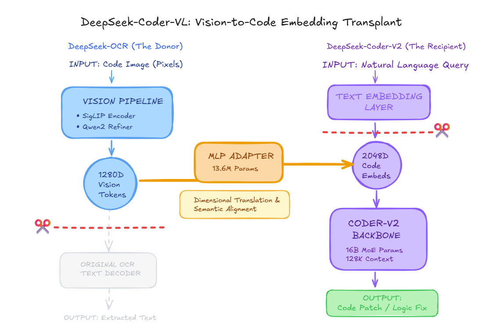
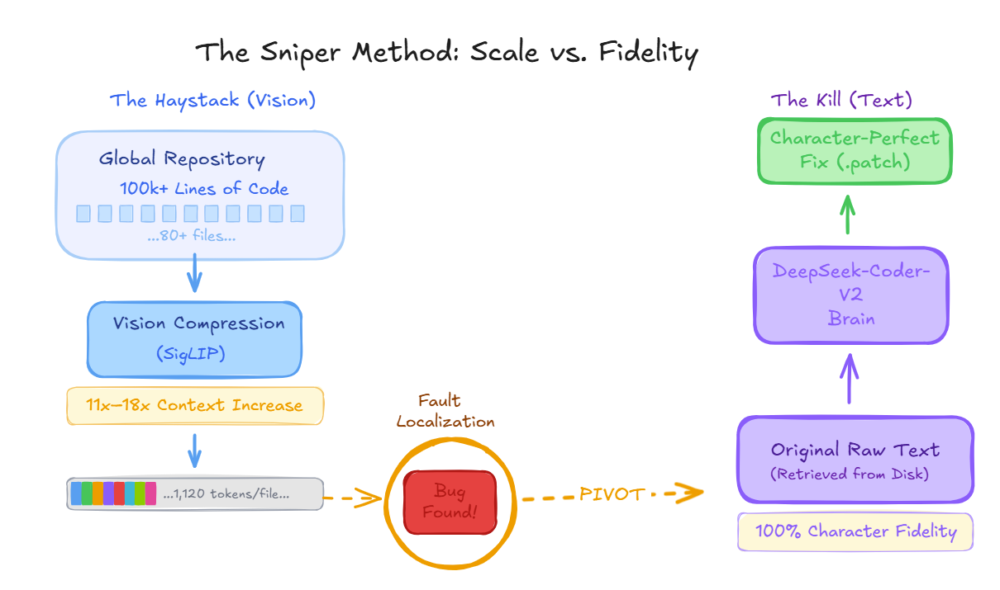

## DeepSeek-Coder-VL: Vision-Enabled Code Reasoning

DeepSeek-Coder-VL is an experimental multimodal **code reasoning** project that combines:
- The **vision encoder** from DeepSeek-VL2 / DeepSeek-OCR-2 (SigLIP),
- With the **code-focused language model** DeepSeek-Coder-V2-Lite,
to let an LLM **read code as images** instead of plain text.

The core idea is simple:
- Large real-world repos (like those in SWE-bench) contain **hundreds of files**.
- Text-only LLMs can only fit **a handful of files** into their context window.
- The DeepSeek vision encoder can compress a 1500–2500 line code file into **≈1,120 visual tokens**, giving **5–20× better token efficiency** than text.
- By feeding these compressed visual tokens into a strong code LLM, we aim to:
  - See **50–100+ files at once**,
  - Still have room in context for bug reports, tests, and reasoning,
  - And ultimately generate **high-quality patches** for real GitHub issues.

At a high level, the target architecture is:

```text
Code images (from repo files)
   → SigLIP vision encoder (frozen, 1280D embeddings)
   → Projection adapter MLP (learned bridge: 1280D → 2048D)
   → DeepSeek-Coder-V2-Lite (code LLM with LoRA)
   → Bug localization, explanations, and code fixes
```

The diagram below illustrates this **vision-to-code embedding transplant**. On the left, the DeepSeek-OCR turns a code image into 1280D vision tokens via its vision pipeline (SigLIP + refiner); the original OCR text-decoder path is unused. In the middle, a **learned MLP adapter** (13.6M parameters) does dimensional translation and semantic alignment from 1280D to 2048D. On the right, the **recipient** (DeepSeek-Coder-V2) normally consumes text embeddings; here, the adapter’s output is fed in instead, so the model receives visual code representations and can produce code patches or logic fixes.



I plan to use a **Sniper Method** that separates scale (vision) from fidelity (text): first localize the bug over the whole repo with compressed visual tokens, then pivot to raw text only for the localized file to produce a character-perfect patch. This hybrid design is inspired by the coverage–fidelity trade-offs and code-as-vision paradigm in CodeOCR (Shi et al., 2026) and LongCodeOCR (2026); my pipeline, model choices, and staging are my own.



---

## Project status and progress (Feb 2026)

### Where things stand

Have a working pipeline: code is rendered to images, passed through a frozen vision encoder, and a **learned projection adapter** maps those visual features into the code model’s space. The vision encoder and code model stay frozen; only the adapter is trained. That’s **Phase 2a**. I have run it to completion on ~37k training and ~2k validation examples (code-understanding tasks: function listings, signatures, import lists, short descriptions). I have also built out the next stage, **Phase 2b**, where LoRA is added on the code model so it can adapt to the visual stream. This job is currently running.

### Phase 2a results

Training behaved well: loss went from about 1.70 to 1.34 over two epochs, and validation loss settled around 1.36. Then ran a **full evaluation** on all 2,086 held-out examples.

- **ROUGE-L** (overlap with reference answers): **0.28** — this is above my initial target. The model is learning to produce text that overlaps with what we want.
- **Exact-match** on function listings: **~1%** (5 of 454) — far below target. The model rarely gets the exact list of function names right. Which is expected for this phase.
- **Diversity** (Distinct-1): **0.11** — below target. Outputs are repetitive.

By task type, overlap is strongest on **import listing** (0.45) and **function listing** (0.33), and weakest on **free-form description** (0.05). So: the adapter is picking up *structure* (that there are imports, functions, etc.) but often **hallucinates the specific symbols** and struggles when the task is open-ended description.

**Bottom line:** Phase 2a shows that visual tokens can carry useful code-structure signal and that the adapter learns a non-trivial mapping. It is not enough for precise, symbol-level answers—hence moving to Phase 2b (adapter + LoRA) to give the code model capacity to adapt to the visual channel and improve exact-match and diversity.

### Phase 2b results (adapter + LoRA)

Training with QLoRA on top of the adapter kept validation loss in a similar range while modestly improving structural overlap. A full evaluation on the Phase 2b validation set (2,018 examples) using the best checkpoint gives:

- **G4 ROUGE-L:** **0.3079** (threshold > 0.25) → **PASS**.  
- **G5 function exact-match:** **0.0000** (0/409 examples, threshold > 0.30) → **FAIL**.  
- **G6 Distinct-1:** **0.2002** (threshold > 0.30) → **FAIL**.  
- **ROUGE-L by task type:** `class_listing` **0.6172**, `description` **0.0704**, `function_explanation` **0.0985**, `function_listing` **0.3652**, `function_signatures` **0.3511**, `import_listing` **0.4084**.

In short, Phase 2b strengthens the model’s ability to capture **file-level structure** from images but still fails to reliably reproduce exact symbol lists or diverse free-text descriptions—consistent with using the vision pathway mainly for **localization**, with text handling precise reasoning and patching.

### Plan going forward

- **Phase 2b:** Train the adapter and LoRA on the code model together, reusing the same data and evaluation. Goal: better exact-match and less repetitive output without overfitting.
  
  **Expectation:** Phase 2b should significantly improve exact-match because LoRA gives the code model a small, trainable set of weights that can *adapt its internal representations* to the visual token stream. In Phase 2a, the model can learn the “shape” of the answer, but it struggles to reliably bind visual evidence to the exact symbol-level output (e.g., precise function names). Allowing limited fine-tuning of the code model is intended to improve that symbol grounding while keeping training computationally feasible.
  
  **Why this staged technique:** freezing the large models first isolates whether the visual pathway carries useful signal and provides a stable baseline; then Phase 2b adds controlled capacity (LoRA) to close the gap on exact-match without fully fine-tuning the entire model.

---

The long-term goal is a practical, open-weights agent that can tackle SWE-bench–style bugs by **seeing entire repositories at once** rather than peeking at a few files at a time.